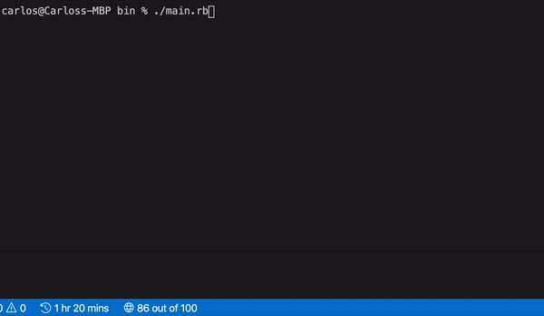

# Object-Oriented Programming - Tic Tac Toe Game

In this project, we build a Tic Tac Toe game. The main goal is to put into practice the main concepts of Object Oriented Programming. Particularly, classes and access to their attributes.

# Tic Tac Toe Instructions

The object of the game is to be the first player to get three in a row. 
Each player picks a symbol to represent them X's or O's. Alternating turns each player picks one empty space and place their symbol in it.  The first player to get three in a row horizontally vertically or diagonally wins.  
Once all the spaces are filled if there is no winner than it is a draw.  
Play the best of three alternating who takes the first turn.

# How to play the game
1- Start the game by executing: ./main.rb inside the repository /bin folder.

2- Select New Game by Typing '1'(if you wish to exit type the word 'exit').

3- After selecting option 1 (new game), the program will ask for each player's name.

4- After the names are introduced, the game will show the board scheme you should follow to enter your moves, and prompt each game to enter a move.

Board Scheme (its the map you will be using to select positions on the board).

 -  1 | 2 | 3 
 -  4 | 5 | 6 
 -  7 | 8 | 9 

5- If you want to select position 1 in the board. Type '1' and hit enter-key, when your name is prompted to enter your move.

6- After you enter your move, the program will show an empty board with a mark in the position you wanted to place your move.

(Remember : The object of the game is to be the first player to get three in a row.)

7- When either play completes the objective of creating a row with their positions the game will congratulate the winner!
Otherwise if no player has won and all the positions are filled the game will be declared a draw!

8- You will be asked if you want to play again , type 'Y' or 'N' for yes and no. 

## The video below is a small segment of what to do when you are playing the game.

## Built With

- Ruby
- Visual Studio Code
- Rubocop
- Object Oriented Design

To get a local copy up and running follow these simple example steps.

### Prerequisites
    - You need to have ***Ruby*** installed on your machine ([Check this out](https://www.ruby-lang.org/en/documentation/installation/) for instructions on installing ruby)

### Usage
    To run the code go to the local folder where you have the *Ruby file* and run in the terminal `$ ruby file.rb` being 'file' the one you want to run

## Authors

👤 **Dannison Arias**

- Github: [@dannisonarias](https://github.com/dannisonarias)
- Twitter: [@AriasDannison](https://twitter.com/AriasDannison)
- Linkedin: [Dannison Arias](https://www.linkedin.com/in/dannison-arias-777919190/)

👤 **Carlos Anriquez**

- Github: [@canriquez](https://github.com/canriquez)
- Twitter: [@cranriquez](https://twitter.com/cranriquez)
- Linkedin: [linkedin](https://www.linkedin.com/in/carlosanriquez/)

## 🤝 Contributing

Contributions, issues and feature requests are welcome!

Feel free to check the [issues page](issues/).

## Show your support

Give a ⭐️ if you like this project!

## Acknowledgments

- Hat tip to Odin and Microverse

## 📝 License

This project is [MIT](lic.url) licensed.